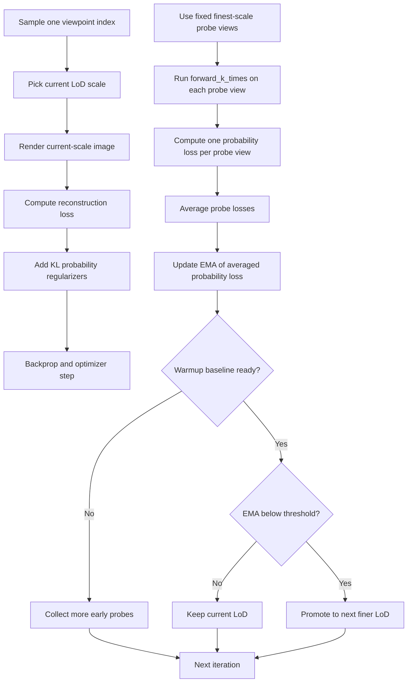
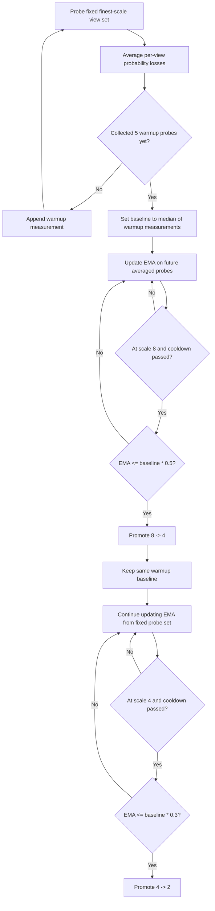

# Probability-Loss LoD Scheduler

For the separate draft alternative that starts at the finest scale and only falls back to coarser scales when finest-scale probability loss degrades, see:

- [`train_bidirectional_lod.py`](/home/christoa/Workspace/splatting/variational-3dgs/train_bidirectional_lod.py)
- [`bidirectional_probability_lod_scheduler.md`](/home/christoa/Workspace/splatting/variational-3dgs/docs/bidirectional_probability_lod_scheduler.md)

## Goal

This training routine combines two ideas:

- variational 3DGS uncertainty estimation
- coarse-to-fine level-of-detail training

The optimization step renders at the current LoD scale, but the decision to move to a finer scale is based on uncertainty measured at the finest configured training scale.

## Resolution semantics

The scheduler expects:

- `--resolution_scales 2 4 8`

In this codebase:

- `2` means finest among the scheduled training scales
- `8` means coarsest

Internally, training order is:

1. scale `8`
2. scale `4`
3. scale `2`

The first element of `--resolution_scales` is treated as the finest reference scale for uncertainty evaluation.

## Core interaction

- A single camera index is sampled for the optimization step.
- That same index is available at every resolution scale.
- The active render for gradient descent uses the current LoD scale.
- Periodically, a fixed small probe set of canonical training views is rendered at the finest scale with `forward_k_times(...)`.
- Each finest-scale Monte Carlo render produces:
  - per-sample RGBs
  - predictive standard deviation
- `nll_kernel_density(...)` converts each probe view output into a probability loss.
- The probe losses are averaged into one scheduler measurement.
- That averaged probability loss is smoothed with an EMA.
- Promotion checks only start after the scheduler has built a robust baseline from several early probe measurements.
- When the EMA falls below the configured threshold for the current stage, training is promoted to the next finer LoD.

## Mermaid flow

## Threshold logic

The scheduler no longer uses a one-shot baseline from the first valid probe.

Instead it:

1. collects the first `--probability_lod_baseline_warmup_probes` scheduler measurements
2. computes the median of those measurements
3. stores that median as `baseline_probability_loss`

Each scheduler measurement is itself an average over `--probability_lod_probe_num_views` fixed finest-scale probe views.

With defaults:

- `--probability_lod_thresholds 0.5 0.3`
- `--probability_lod_probe_num_views 4`
- `--probability_lod_baseline_warmup_probes 5`

the stage transitions are:

- establish the baseline from the median of the first `5` averaged probe measurements
- `8 -> 4` when `EMA <= baseline * 0.5`
- `4 -> 2` when `EMA <= baseline * 0.3`

The scheduler also waits at least `--probability_lod_min_iterations` iterations between promotions.

## Shared-baseline promotion logic

Both promotions are checked against the same warmup baseline.

The baseline is set once from the early fixed-view probe window and is not reset after the first promotion.

That means the second promotion is:

- not a fraction of the loss measured right after `8 -> 4`
- not a fraction of the EMA value at the first promotion event
- instead, another fraction of the original warmup baseline, typically with a smaller ratio

Example with:

- `--resolution_scales 2 4 8`
- `--probability_lod_thresholds 0.5 0.3`
- `--probability_lod_probe_num_views 4`
- `--probability_lod_baseline_warmup_probes 5`

the checks are:

- build `initial_baseline` from the median of the first `5` averaged fixed-view probe values
- `8 -> 4` when `EMA <= initial_baseline * 0.5`
- `4 -> 2` when `EMA <= initial_baseline * 0.3`

## Shared-baseline Mermaid flow

## Loss roles

There are two different probability-related signals in the loop:

### 1. Training regularizer

The optimization loss includes the variational regularizers:

- `compute_kl_uniform_scal()`
- `compute_kl_xyz()`
- `compute_kl_opacity()`

These are part of the backpropagated training loss every iteration.

### 2. Scheduling probe

The LoD scheduler uses:

- `forward_k_times(...)`
- `nll_kernel_density(...)`

This probe is not backpropagated in the scheduler path. It is used only to decide when uncertainty has fallen enough to justify a finer training scale.

The current implementation makes that controller more robust in three ways:

- it probes a fixed set of views instead of a random single view
- it averages probe losses across that set before updating the EMA
- it uses a warmup median baseline instead of a one-shot baseline

## Why the finest scale drives promotion

Using the finest configured scale for the uncertainty probe keeps promotion decisions tied to the highest-detail target the model must eventually fit.

That avoids a common failure mode where:

- coarse images look stable early
- the scheduler promotes based on low-detail confidence
- finer-scale uncertainty is still high

By measuring uncertainty at scale `2`, the LoD routine promotes only after the model becomes more certain on the sharpest scheduled supervision.

## Runner integration

[`run_exp.py`](/home/christoa/Workspace/splatting/variational-3dgs/run_exp.py) now forwards the scheduler robustness settings explicitly for experiment runs:

- `--probability_lod_interval 50`
- `--probability_lod_min_iterations 1000`
- `--probability_loss_ema_alpha 0.1`
- `--probability_lod_probe_num_views 4`
- `--probability_lod_baseline_warmup_probes 5`

It also supports optional per-experiment `probability_lod_thresholds` entries if you want to hard-code threshold schedules for selected runs.

## Files involved

- [`train.py`](/home/christoa/Workspace/splatting/variational-3dgs/train.py)
- [`run_exp.py`](/home/christoa/Workspace/splatting/variational-3dgs/run_exp.py)
- [`gaussian_renderer/__init__.py`](/home/christoa/Workspace/splatting/variational-3dgs/gaussian_renderer/__init__.py)
- [`scene/__init__.py`](/home/christoa/Workspace/splatting/variational-3dgs/scene/__init__.py)
- [`utils/image_utils.py`](/home/christoa/Workspace/splatting/variational-3dgs/utils/image_utils.py)
