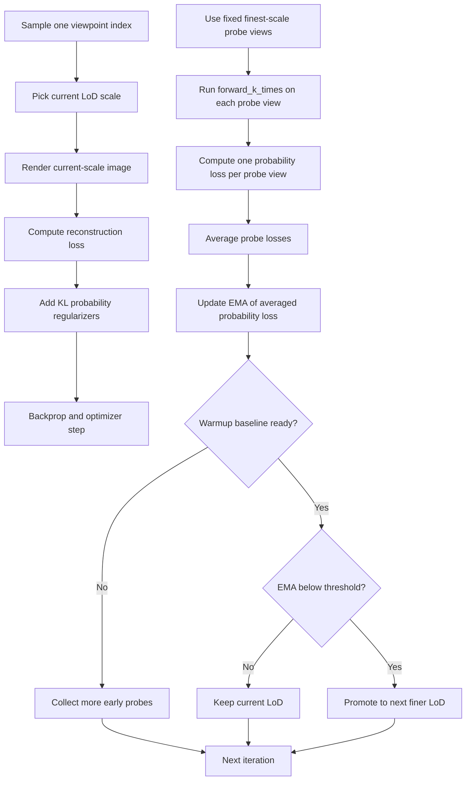
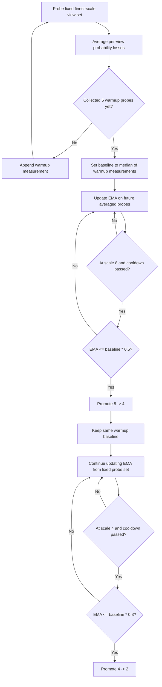

# Probability-Loss LoD Scheduler

For the separate draft alternative that starts at the finest scale and only falls back to coarser scales when finest-scale probability loss degrades, see:

- [`train_bidirectional_lod.py`](/mnt/share/nas/christo/splatting/variational-3dgs/train_bidirectional_lod.py)
- [`bidirectional_probability_lod_scheduler.md`](/mnt/share/nas/christo/splatting/variational-3dgs/docs/bidirectional_probability_lod_scheduler.md)

## Goal

This training routine combines two ideas:

- variational 3DGS uncertainty estimation
- coarse-to-fine level-of-detail training

The optimization step renders at the current LoD scale, but the decision to move to a finer scale is based on uncertainty measured at the finest configured training scale.

The current implementation is no longer the original one-shot / single-view scheduler. It now uses:

- a fixed small probe set of canonical views
- stable `model_id`-driven ensemble members for the uncertainty probe
- a warmup median baseline instead of a one-shot baseline
- an optional `--match_resolution` mode so coarse levels can be blur-only rather than smaller tensors

## Resolution semantics

The scheduler expects:

- `--resolution_scales 2 4 8`

In this codebase:

- `2` means finest among the scheduled training scales
- `8` means coarsest

Internally, training order is:

1. scale `8`
2. scale `4`
3. scale `2`

The first element of `--resolution_scales` is treated as the finest reference scale for uncertainty evaluation.

If `--match_resolution` is enabled, all LoD levels are resized back to the finest training resolution after loading. In that mode:

- coarse LoD levels still come from lower-resolution source images
- but they are upsampled to the finest training size before rendering
- the LoD difference is therefore blur/detail rather than tensor shape

## Core interaction

- A single camera index is sampled for the optimization step.
- That same index is available at every resolution scale.
- The active render for gradient descent uses the current LoD scale.
- Periodically, a fixed small probe set of canonical training views is rendered at the finest scale with `forward_k_times(...)`.
- `forward_k_times(...)` now evaluates stable `model_id`-driven ensemble members instead of relying on fresh uncontrolled resampling for every probe sample.
- Each finest-scale ensemble render produces:
  - per-sample RGBs
  - predictive standard deviation
- `nll_kernel_density(...)` converts each probe view output into a probability loss.
- The probe losses are averaged into one scheduler measurement.
- That averaged probability loss is smoothed with an EMA.
- Promotion checks only start after the scheduler has built a robust baseline from several early probe measurements.
- When the EMA falls below the configured threshold for the current stage, training is promoted to the next finer LoD.

## Mermaid flow

## Threshold logic

The scheduler no longer uses a one-shot baseline from the first valid probe.

Instead it:

1. collects the first `--probability_lod_baseline_warmup_probes` scheduler measurements
2. computes the median of those measurements
3. stores that median as `baseline_probability_loss`

Each scheduler measurement is itself an average over `--probability_lod_probe_num_views` fixed finest-scale probe views.

With defaults:

- `--probability_lod_thresholds 0.5 0.3`
- `--probability_lod_probe_num_views 4`
- `--probability_lod_baseline_warmup_probes 5`

the stage transitions are:

- establish the baseline from the median of the first `5` averaged probe measurements
- `8 -> 4` when `EMA <= baseline * 0.5`
- `4 -> 2` when `EMA <= baseline * 0.3`

The scheduler also waits at least `--probability_lod_min_iterations` iterations between promotions.

## Shared-baseline promotion logic

Both promotions are checked against the same warmup baseline.

The baseline is set once from the early fixed-view probe window and is not reset after the first promotion.

That means the second promotion is:

- not a fraction of the loss measured right after `8 -> 4`
- not a fraction of the EMA value at the first promotion event
- instead, another fraction of the original warmup baseline, typically with a smaller ratio

Example with:

- `--resolution_scales 2 4 8`
- `--probability_lod_thresholds 0.5 0.3`
- `--probability_lod_probe_num_views 4`
- `--probability_lod_baseline_warmup_probes 5`

the checks are:

- build `initial_baseline` from the median of the first `5` averaged fixed-view probe values
- `8 -> 4` when `EMA <= initial_baseline * 0.5`
- `4 -> 2` when `EMA <= initial_baseline * 0.3`

## Shared-baseline Mermaid flow

## Loss roles

There are two different probability-related signals in the loop:

### 1. Training regularizer

The optimization loss includes the variational regularizers:

- `compute_kl_uniform_scal()`
- `compute_kl_xyz()`
- `compute_kl_opacity()`

These are part of the backpropagated training loss every iteration.

The combined KL block is also scaled by:

- `--probability_regularizer_weight`

This is a loss weight, not a separate optimizer learning rate. Lowering it slows how strongly the variational regularizer shapes training.

### 2. Scheduling probe

The LoD scheduler uses:

- `forward_k_times(...)`
- `nll_kernel_density(...)`

This probe is not backpropagated in the scheduler path. It is used only to decide when uncertainty has fallen enough to justify a finer training scale.

The current implementation makes that controller more robust in three ways:

- it probes a fixed set of views instead of a random single view
- it averages probe losses across that set before updating the EMA
- it uses a warmup median baseline instead of a one-shot baseline

It also makes the per-probe uncertainty estimate more comparable over time:

- `model_id` now selects stable ensemble members
- repeated probe calls evaluate the same ensemble members again instead of fresh random resamples
- changes in probe loss therefore reflect model changes more than probe-sampling drift

## Interpreting Probe Metrics

`probability_probe_loss` is a calibration-style score, not a reconstruction loss.

That means it is not expected to move in lockstep with:

- photometric loss
- total training loss
- PSNR
- L1

The probe is computed with `nll_kernel_density(...)`, which depends on both:

- the mean prediction error
- the predicted standard deviation across probe samples

So the metric answers a different question:

- not "how sharp is the mean render?"
- but "how well does the predicted uncertainty match the remaining error?"

### Why `probability_probe_loss` can rise while image quality improves

This usually indicates growing overconfidence.

Typical pattern:

1. the mean render keeps improving
2. residual error becomes smaller but does not vanish
3. predicted uncertainty shrinks even faster
4. the NLL-style probe penalizes the model for being too certain about still-imperfect pixels

As a result:

- photometric loss may go down
- total loss may go down
- PSNR may go up
- `probability_probe_loss` may still rise

### Why higher `probability_probe_loss_std` can sometimes help

Higher `probability_probe_loss_std` means the ensemble members disagree more on the probe views.

That is not automatically good or bad.

It can improve the probe loss when the model was previously underestimating uncertainty:

- if the mean render still has noticeable error
- and the ensemble spread was too tight
- then a larger predictive standard deviation can make the prediction better calibrated

In that case:

- `probability_probe_loss_std` may increase
- `probability_probe_loss` may decrease
- eval metrics may also improve if the mean render improved at the same time

This does not mean "more uncertainty is always better."

It means the probe favors calibration:

- too little spread can hurt because the model is overconfident
- too much spread can also hurt because the predictive distribution becomes too diffuse
- the best probe score appears when the ensemble spread matches the remaining residual error

## Logging Outputs

Current `train.py` logging distinguishes the training objective from the scheduler probe.

WandB train logs include:

- `train/photometric_loss`
- `train/total_loss`
- `train/kl_loss`
- `train/probability_probe_loss`
- `train/probability_probe_loss_std`
- `train/lod_scale`

The per-run CSV output is more detailed:

- `train_metrics.csv`
- `eval_metrics.csv`

`train_metrics.csv` also includes:

- `kl_scale_loss`
- `kl_xyz_loss`
- `kl_opacity_loss`
- `probability_regularizer`
- `probability_probe_loss_ema`

This matters because the scheduler probe is not the same term that enters the optimizer.

## Runner Integration

`run_exp.py` currently defines three experiment families:

- `baseline`
- `lod`
- `matched-lod`

Their meanings are:

- `baseline`: single fixed scale, no LoD progression
- `lod`: regular coarse-to-fine LoD training
- `matched-lod`: regular coarse-to-fine LoD training with `--match_resolution`

Current regular-runner defaults are:

- `--probability_lod_interval 50`
- `--probability_lod_min_iterations 1000`
- `--probability_loss_ema_alpha 0.2`
- `--probability_lod_probe_num_views 4`
- `--probability_lod_baseline_warmup_probes 5`

KL-weight sweep behavior in `run_exp.py`:

- `baseline` uses only `--probability_regularizer_weight 1.0`
- `lod` sweeps `1.0`, `0.5`, `0.1`
- `matched-lod` sweeps `1.0`, `0.5`, `0.1`

It means:

- too little uncertainty is penalized when the mean prediction is still wrong
- the best probe score occurs when uncertainty matches the true residual error scale

### Practical reading guide

Use the metrics this way:

- `photometric_loss`, `L1`, and `PSNR` track mean-render quality
- `probability_probe_loss` tracks calibration of the predictive distribution
- `probability_probe_loss_std` tracks ensemble spread on the fixed probe set

Because they measure different things, inverse trends between them are possible and expected.

## Why the finest scale drives promotion

Using the finest configured scale for the uncertainty probe keeps promotion decisions tied to the highest-detail target the model must eventually fit.

That avoids a common failure mode where:

- coarse images look stable early
- the scheduler promotes based on low-detail confidence
- finer-scale uncertainty is still high

By measuring uncertainty at scale `2`, the LoD routine promotes only after the model becomes more certain on the sharpest scheduled supervision.

## Stable ensemble members

The current codebase no longer treats the uncertainty probe as pure fresh Monte Carlo resampling on every call.

Instead:

- each render sample in `forward_k_times(...)` corresponds to a stable `model_id`
- `model_id` is now threaded into Gaussian sampling so scale, xyz, and opacity perturbations are repeatable for that member
- the scheduler probe is therefore a consistent finite-ensemble estimate rather than a moving target dominated by fresh draw noise

This is mainly a controller-stability change:

- training still samples one active member per iteration for optimization
- the probe now compares like with like across iterations
- that usually makes `probability_probe_loss` and its EMA easier to interpret

## Runner integration

[`run_exp.py`](/mnt/share/nas/christo/splatting/variational-3dgs/run_exp.py) now forwards the scheduler robustness settings explicitly for experiment runs:

- `--probability_lod_interval 50`
- `--probability_lod_min_iterations 1000`
- `--probability_loss_ema_alpha 0.1`
- `--probability_lod_probe_num_views 4`
- `--probability_lod_baseline_warmup_probes 5`

It also supports optional per-experiment `probability_lod_thresholds` entries if you want to hard-code threshold schedules for selected runs.

## Logging Outputs

The current code logs the scheduler and training signals in three places:

- WandB:
  - `train/photometric_loss`
  - `train/total_loss`
  - `train/kl_scale_loss`
  - `train/probability_probe_loss`
  - `train/probability_probe_loss_std`
  - `train/lod_scale`
- TensorBoard:
  - `probability_probe_loss`
  - `probability_probe_loss_ema`
  - `total_loss`
  - `kl_scale_loss`
- Per-run CSV files in the output directory:
  - `train_metrics.csv`
  - `eval_metrics.csv`

These CSV files make the scheduler behavior inspectable without relying on WandB.

## Match-Resolution Option

The camera-loading path supports:

- `--match_resolution`

When enabled:

- the first scale in `--resolution_scales` still defines the target training size
- lower scales are first downsampled according to their scale factor
- then resized back to that target size

This is useful when you want:

- the same render tensor size at every LoD level
- lower LoD levels to behave like blurred supervision instead of genuinely smaller images

## Files involved

- [`train.py`](/mnt/share/nas/christo/splatting/variational-3dgs/train.py)
- [`run_exp.py`](/mnt/share/nas/christo/splatting/variational-3dgs/run_exp.py)
- [`gaussian_renderer/__init__.py`](/mnt/share/nas/christo/splatting/variational-3dgs/gaussian_renderer/__init__.py)
- [`scene/__init__.py`](/mnt/share/nas/christo/splatting/variational-3dgs/scene/__init__.py)
- [`scene/gaussian_model.py`](/mnt/share/nas/christo/splatting/variational-3dgs/scene/gaussian_model.py)
- [`utils/image_utils.py`](/mnt/share/nas/christo/splatting/variational-3dgs/utils/image_utils.py)
